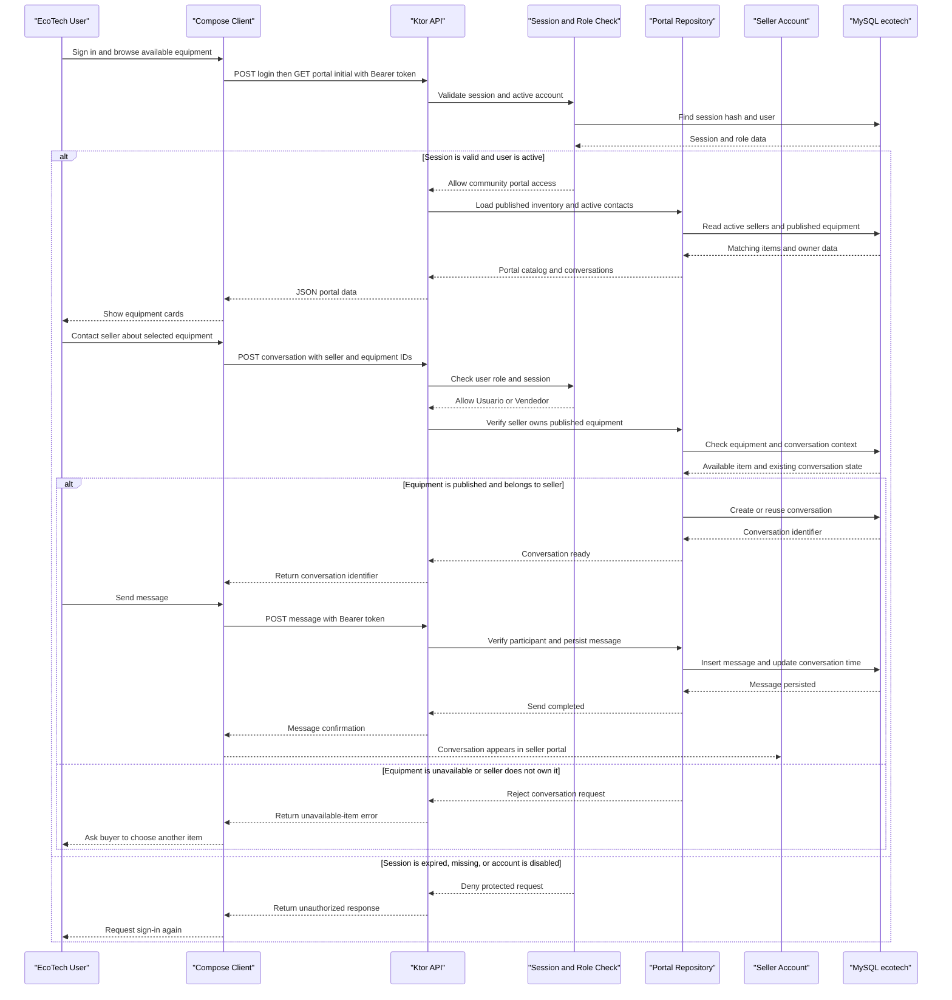

# Core Business Workflows

EcoTech coordinates the reuse of electronic equipment by connecting users, sellers, operators, technicians, beneficiaries, and administrators. Its business processes cover equipment publication and contact, collection, technical assessment, repair, delivery, and operational oversight.

## Domain Entities

| Entity | Service / Bounded Context | Description | Key Relationships |
|---|---|---|---|
| Usuario | Identity and Access | A person with an account and a business role in EcoTech. | Owns sessions; may publish equipment, participate in conversations, perform technical work, or register operations. |
| Sesión de aplicación | Identity and Access | A time-limited authenticated client session. | Belongs to one user; authorizes API requests while valid and the user remains active. |
| Ciudad | Reference Data | Geographic catalog entry used to organize people and collection locations. | Referenced by donors, beneficiaries, and collection points. |
| Tipo de equipo | Reference Data | Category used to classify electronic equipment. | Classifies equipment and supports seller publication. |
| Donante | Donation Management | Person or organization that provides equipment. | May be associated with received equipment and a city. |
| Equipo | Inventory and Reuse | Electronic device tracked through intake, publication, assessment, repair, and delivery. | Has a type; may come from a donor or seller; may have diagnostics, repairs, and a delivery. |
| Beneficiario | Delivery Management | A person registered as a recipient of equipment. | May be associated with a city and receive equipment through a delivery. |
| Diagnóstico | Technical Operations | Technical assessment of a piece of equipment and its repair need. | Refers to an equipment item and the technician who performs the assessment. |
| Reparación | Technical Operations | Work performed to restore a piece of equipment. | Refers to an equipment item and the responsible technician. |
| Entrega | Delivery Management | Record that equipment was handed to a beneficiary. | Connects equipment, beneficiary, and the user who registers the delivery. |
| Punto de recolección | Collection Management | Location where equipment can be received, with public-facing hours and instructions. | May be associated with a city and is shown publicly only when active. |
| Conversación | Community Communication | A contact thread between two users, optionally tied to a published device or an operator request. | Has two user participants and contains messages; its context distinguishes seller and operator contact. |
| Mensaje | Community Communication | A communication sent by a participant in a conversation. | Belongs to a conversation and identifies the sender. |
| Evento de auditoría | Oversight | Record of a selected business or administrative operation. | Identifies affected context and record where available; actor and snapshots depend on the recording mechanism. |

## Service-to-Domain Mapping

| Service | Domain Context | Owned Entities | External Dependencies |
|---|---|---|---|
| EcoTech Compose client | Role portals and user interaction | Client-side representations of users, equipment, points, conversations, messages, and dashboard data; it does not own authoritative business records. | EcoTech HTTP API using JSON and Bearer session tokens. |
| EcoTech Ktor API | Identity and Access; Inventory and Reuse; Community Communication; Technical Operations; Donation and Delivery Management; Collection Management; Oversight | All authoritative business entities listed above, persisted through the server repositories. | MySQL database, JDBC connection pool, Exposed ORM. |
| MySQL database `ecotech` | Shared persistence | Relational source of truth for application records. | Accessed by the Ktor service; optional SQL scripts/triggers may be installed separately for portal-side auditing/schema behavior. |

EcoTech is currently a modular client/server application, not a set of independently deployed microservices. The Ktor server is the source of truth and the client calls it over HTTP/JSON. Domain relationships are represented in the shared relational schema; the API does not exchange domain events between independently owned services. SQL triggers installed through separate web-project scripts are a separate write path and should not be assumed to run unless deployed.

## Primary Workflows

### Workflow 1: Account registration, login, and authenticated access

1. A new public user submits profile details and selects the public `Usuario` or `Vendedor` role through `POST /api/auth/register`. Internal roles are created by administration rather than public self-registration.
2. The API validates required fields, basic email shape, password minimum length, and allowed public role; it rejects an existing email.
3. On login through `POST /api/auth/login`, the API looks up the account, verifies the credential, and refuses disabled accounts. New credentials use BCrypt; legacy SHA-256 hashes are upgraded to BCrypt after successful verification.
4. The API creates a random opaque token and stores its SHA-256 hash with its user and expiry in `AppSessions`. It returns the raw token and user profile to the client.
5. The client sends the token as a Bearer credential on protected API requests. The server checks the session expiry and active account before applying role authorization.
6. Logout calls `POST /api/auth/logout` to revoke the server-side session. The client can offer a local-only logout fallback if the API cannot be reached.

### Workflow 2: Equipment publication, discovery, and seller contact

1. An authenticated seller selects a catalog equipment type and submits brand, model, optional serial, and description through `POST /api/portal/equipment`.
2. The API accepts publication only for `Vendedor`, binds ownership to the authenticated user rather than trusting a client-supplied owner, and stores the device as published with the `Publicado` state.
3. The portal composes public inventory from published equipment belonging to active sellers. A user can browse equipment and active collection points.
4. A user or seller requests a conversation with the seller about the equipment. The server verifies that the contact is a seller and that the selected equipment is still published and belongs to that seller.
5. If a matching conversation already exists in the same context, the service reuses it; otherwise it creates a conversation.
6. Participants exchange messages. Reads and sends are restricted to participants; fetching messages marks incoming messages as read.

### Workflow 3: Collection coordination with an operator

1. An authenticated user or seller chooses an active operator from the portal contact list.
2. The service verifies that the recipient is active, has the Operator role, and is not the requesting account.
3. The service creates or reuses an operator-context conversation.
4. The operator inbox is limited to operator-context conversations addressed to that operator. Both participants can read the thread and send messages.
5. The conversation activity and unread count are derived from persisted messages; updating a thread advances its last-updated time.

### Workflow 4: Technical diagnosis and repair

1. A technician loads inventory and records an assessment for an equipment item.
2. The API sets `tecnicoId` from the authenticated account for technician-created records, preventing a request from assigning work to another technician.
3. The diagnosis records whether repair is required and may include estimated cost. The equipment state changes to `En Reparación` or `Listo para entrega`.
4. If repair is required, the technician records work, parts, actual cost, and repair state.
5. A completed repair changes the equipment state to `Reacondicionado`; an unfinished repair leaves it `En Reparación`.
6. Technician activity is presented using records filtered to that technician. Administrative users retain broader operational visibility.

### Workflow 5: Administration, delivery, and audit review

1. Administrators maintain users and roles, reference catalogs, donors, beneficiaries, equipment, collection points, and delivery operations through protected routes.
2. Operational repositories record selected insert/update/delete events in `Auditoria`.
3. The dashboard aggregates counts, monthly activity, and equipment state distribution from persisted records.
4. Auditors and administrators can retrieve audit entries and statistics. The auditor portal filters and pages the received audit records.
5. Audit event capture from the API is best-effort: current repository code suppresses audit insert failures; API-generated records use a fixed actor label and do not currently populate before/after snapshots. SQL triggers may supply richer snapshots only if separately installed.

## Cross-Service Data Flows

There are no independently deployed business services or API gateway fan-out flows in the current application. The primary composition happens inside the Ktor API:

- The portal initial-load operation reads equipment types, published equipment, active sellers, active collection points, eligible operator contacts, and the current user's conversations from the shared MySQL schema.
- Conversation summaries combine participant names, equipment context, latest message, update time, and unread-message count. Message access is then checked against conversation participation and operator assignment rules.
- The dashboard combines counts and grouped equipment states; monthly activity combines delivery, repair, and equipment intake counts by month.
- The client consumes these composed JSON DTOs but does not join independently sourced services.
- When MySQL is unavailable, business data operations cannot complete. Normal server startup can continue in a degraded state, and `GET /api/health` reports database status; this is not a business-data fallback.
- SQL triggers and scripts used by the PHP website can form an additional database write path, but the Kotlin service does not invoke or verify their installation.

## Business Workflow Sequence

The principal community workflow below begins after successful login and shows a user discovering a published item and contacting its seller.

<!-- mermaid-checked: every participant uses `participant Id as "Label"`, no \n in aliases/messages/notes, every alt/opt/loop closed by end, no `:` inside any alias -->

## Business Rules & Decision Logic

### Identity and access

- Public registration permits only Usuario and Vendedor; administration provisions internal roles.
- Login requires valid credentials and an active user account.
- Authenticated routes require a valid, unexpired Bearer session.
- Session tokens are opaque random values; only their SHA-256 hashes are stored in `AppSessions`; configured expiry is 30 days.
- Role middleware separates public portal, technical work, audit, user administration, collection points, and catalogs.
- A technician's create requests are associated with the authenticated technician; technician activity is scoped to that technician.
- A conversation can only be read or written by a participant. Operators can access only operator-context conversations addressed to them.

### Validation rules

- Registration requires nonblank name, last name, phone, a basic email containing `@`, password length of at least six characters, and a permitted public role.
- Administrative account creation validates profile fields, basic email shape, a password of at least six characters, and one of the recognized roles.
- Published equipment requires a type, nonblank brand and model, and bounded lengths for brand/model, serial, and description.
- A conversation target must exist, be active, differ from the caller, and match the requested target role. Seller conversations require a published item owned by that seller.
- Messages must contain 1 to 2000 characters and belong to an authorized conversation.
- Collection point creation requires a name, address, and hours and enforces the field length limits applied by the route.
- The technician UI rejects blank diagnosis/repair descriptions and negative or malformed optional cost values before submitting.

### State transitions and derived values

- Published equipment is stored with `publicado = true` and `estadoActual = Publicado`; community discovery filters on both conditions and active seller status.
- Diagnosis transitions equipment to `En Reparación` when repair is required, otherwise `Listo para entrega`.
- Repair transitions equipment to `Reacondicionado` when its state is `Completada`, otherwise `En Reparación`.
- New messages update the conversation activity timestamp. Reading a conversation marks incoming messages as read.
- Portal equipment discovery is capped at 100 items in the current repository implementation; message history returns the latest 100 messages.
- Dashboard CO₂ is estimated as 51 kg per equipment record; this is a fixed approximation.

### Transaction and error behavior

- Repository writes generally execute in Exposed transactions. Related state changes, such as a diagnosis and equipment state update, are performed in the same repository transaction.
- Route validation failures return client errors; missing or inaccessible resources return not-found responses in protected conversation/equipment flows.
- Database connectivity is required for durable business operations; startup health can be degraded if database initialization fails.
- Audit inserts are currently best-effort and suppress errors; successful business responses do not prove an audit row was written.

### Audit and data integrity

- API audit rows identify the affected table, operation, record ID when available, timestamp, detail, and a fixed API actor marker.
- Current API audit writes do not include before/after snapshots or the authenticating user's identity.
- SQL triggers and schema scripts are independent of API repository logging and must be deployed and tested separately.
- The Exposed schema is the application's declared relational mapping, but its conversation context column differs semantically from the generated column in the website SQL. Schema migration/versioning and database backup are required when reconciling the two schemas.
